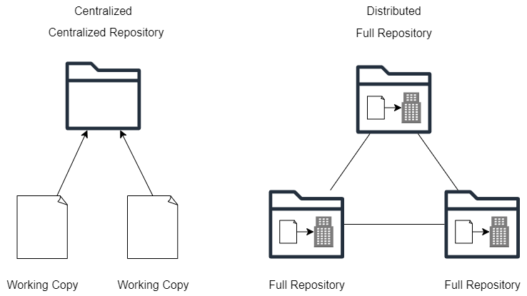

# Introduction to Version Control with Git

## What is Version Control?

Version control is a system that records changes to a file or set of files over time so that you can recall specific versions later. It allows multiple people to collaborate on a project simultaneously without interfering with each other's work.

## What is Git and How Does it Work?

Git is a distributed version control system that allows you to track changes in your codebase efficiently. It works by creating snapshots of your files and storing them in a compressed database. Git enables collaboration among multiple developers by allowing them to work on different branches of the codebase independently and then merge their changes together.

## Basic Git Command Flow

- 'git init'
  This command initializes a new Git repository in the current directory.

  Expected output:
  ```bash
  Initialized empty Git repository in /path/to/repository/.git/
  ```

- 'git status'
  This command shows the current status of the repository, including which files are staged, unstaged, or untracked.

  Expected output:
  ```bash
  On branch master
  Your branch is up to date with 'origin/master'.

  nothing to commit, working tree clean
  ```

- 'git add'
  This command adds changes in the working directory to the staging area.

  Expected output:
  ```
  Changes to be committed:
    (use "git restore --staged <file>..." to unstage)
      new file:   example.txt
  ```

- 'git commit'
  This command records the changes staged in the current branch.

  Expected output:
  ```bash
  [master (root-commit) 1a410ef] Initial commit
   1 file changed, 1 insertion(+)
   create mode 100644 example.txt
  ```

## `git log` and `git diff`

- 'git log'
  This command shows a list of commits in reverse chronological order.

  Expected output:
  ```bash
  commit 1a410ef5d4239
  Author: John Doe <john@example.com>
  Date:   Thu Jun 12 15:42:15 2023 -0700

      Initial commit
  ```

- 'git diff'
  This command shows the differences between various states of your repository.

  Expected output:
  ```bash
  diff --git a/example.txt b/example.txt
  index e69de29..a7b21f4 100644
  --- a/example.txt
  +++ b/example.txt
  @@ -0,0 +1 @@
  +Hello, world!
  ```

## What is `.gitignore` and Why Should We Use It?

'.gitignore' is a file that specifies intentionally untracked files to be ignored by Git. It's useful for excluding files that are generated by the build process, temporary files, or sensitive information that shouldn't be committed to the repository.

## Additional Resources

For more information on Git and how to use it effectively, check out the official Git documentation at [https://git-scm.com/doc](https://git-scm.com/doc).


## Distributed Version Control

### Centralized vs Distributed Version Control



In a centralized version control system, there is a single central repository that stores all versions of files, and users typically checkout a working copy from this central server. Changes are committed directly to the central repository.

In contrast, distributed version control systems like Git allow each user to have their own local repository, which contains the entire history of the project. Users can commit changes locally, create branches, and merge changes without needing access to a central server. This decentralization provides greater flexibility and resilience.

### What is GitHub?

GitHub is a web-based platform that provides hosting for Git repositories. It offers features such as collaboration tools, issue tracking, and pull requests, making it popular among developers for hosting open-source projects and collaborating on code.

### Other Options/Competitors to GitHub

Some alternatives to GitHub include GitLab, Bitbucket, and SourceForge. Each platform offers similar features to GitHub but may have different pricing structures, integrations, or user interfaces.

### Linking a Local Repo to a Remote Repo on GitHub

iii To link a local repository to a remote repository on GitHub, you can use the following commands:

1. Initialize the local repository:
   ```bash
   git init
   ```

2. Add the remote repository URL:
   ```bash
   git remote add origin <remote_repo_URL>
   ```

3. Push the local repository to the remote:
   ```bash
   git push -u origin master
   ```

### Linking a Remote Repo to a New Local Repo

iii To link a remote repository to a new local repository, you can follow these steps:

1. Create a new directory for the local repository:
   ```bash
   mkdir new_project
   cd new_project
   ```

2. Initialize the local repository:
   ```bash
   git init
   ```

3. Add the remote repository URL:
   ```bash
   git remote add origin <remote_repo_URL>
   ```

4. Fetch the contents of the remote repository:
   ```bash
   git fetch origin
   ```

5. Check out the branch you want to work on:
   ```bash
   git checkout <branch_name>
   ```

Now, your new local repository is linked to the remote repository, and you can start working on your project locally.

