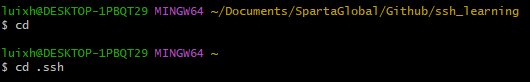
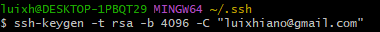
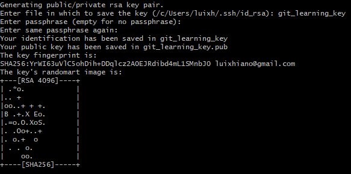
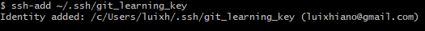
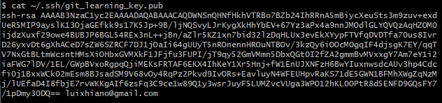
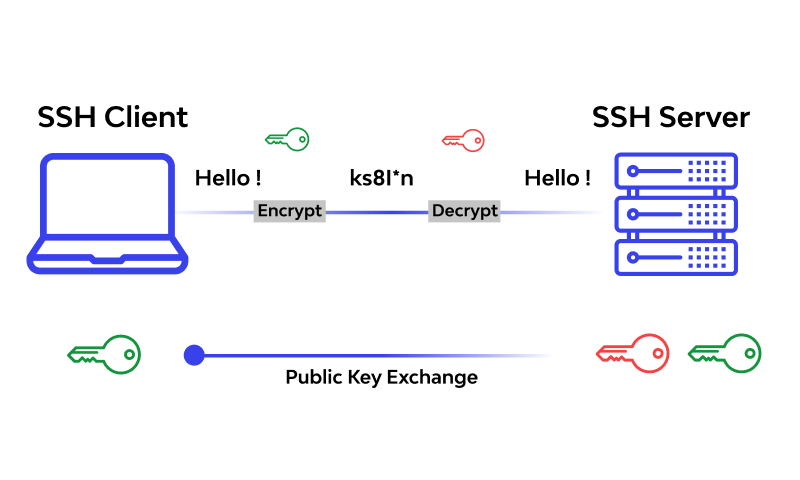

## Using SSH to Access a Repository on GitHub

1. Locate and Enter SSH Folder

2. **Generate SSH Key**: If you haven't already, generate an SSH key pair on your local machine. You can do this by running the following command in your terminal:
  
   This will show the following option where you can name your file

3. Once you have created the key, the next step is to Start the SSH agent and add your SSH private key to it by running the following commands:

4. Now copy the SSH Public Key by display your SSH public key by running the following command:

5. Add SSH Key to GitHub: Go to your GitHub Repo settings, Click "Deploy keys" and then click "Add deplo key", Input the settings and then click Add key.

## SSH Diagram

